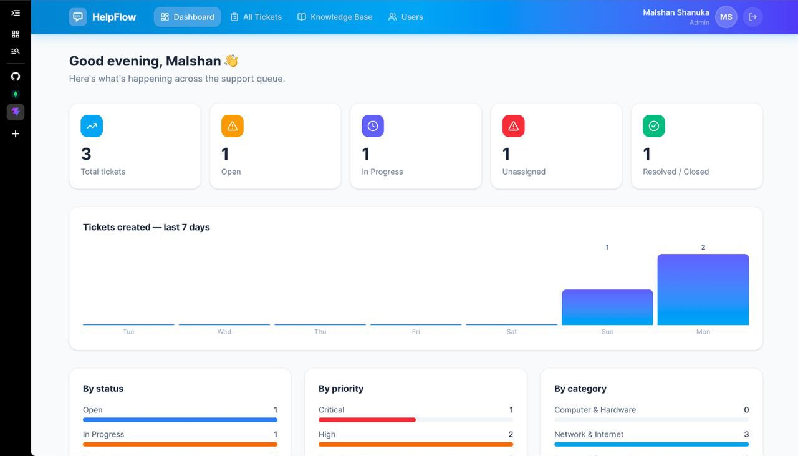
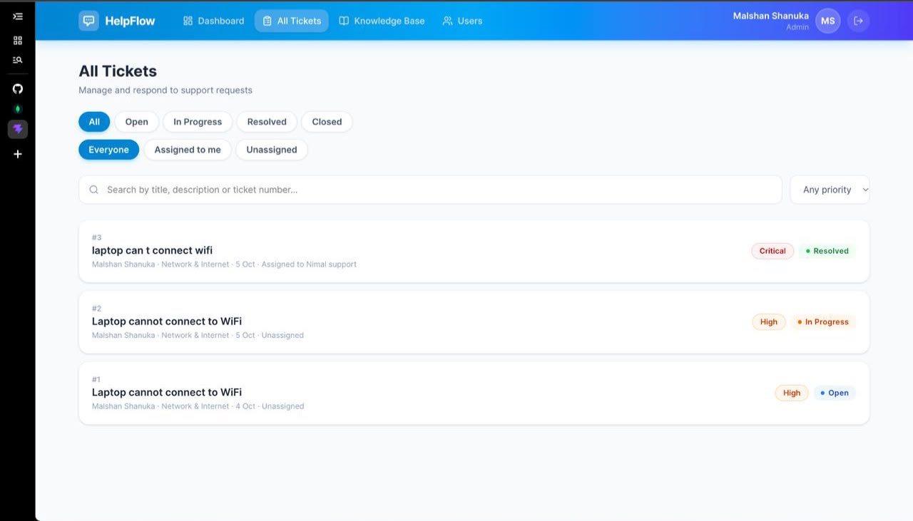
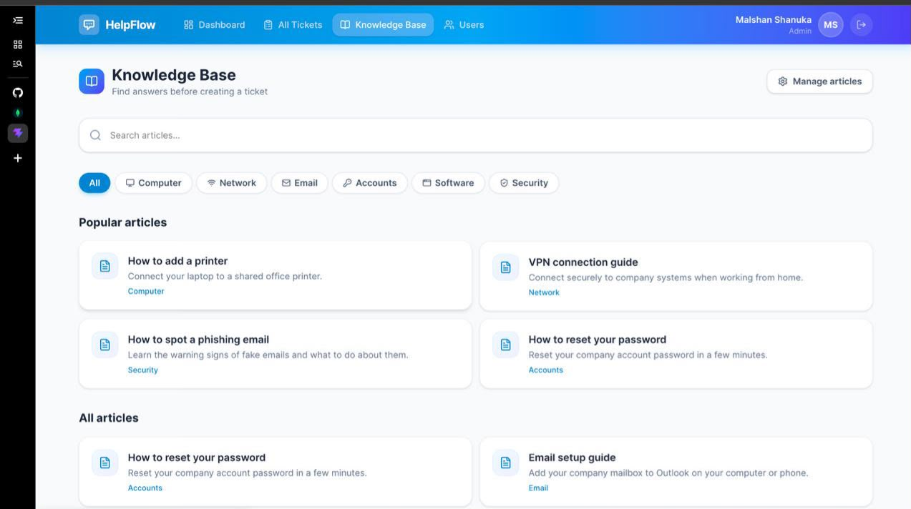
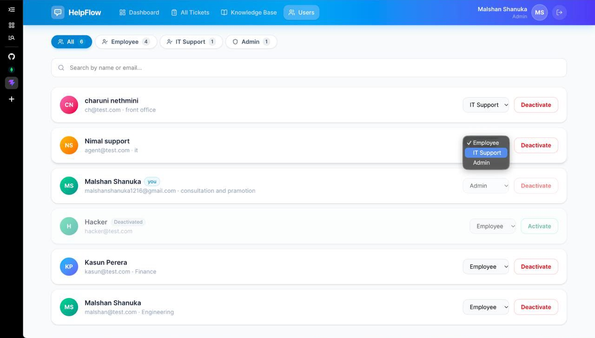
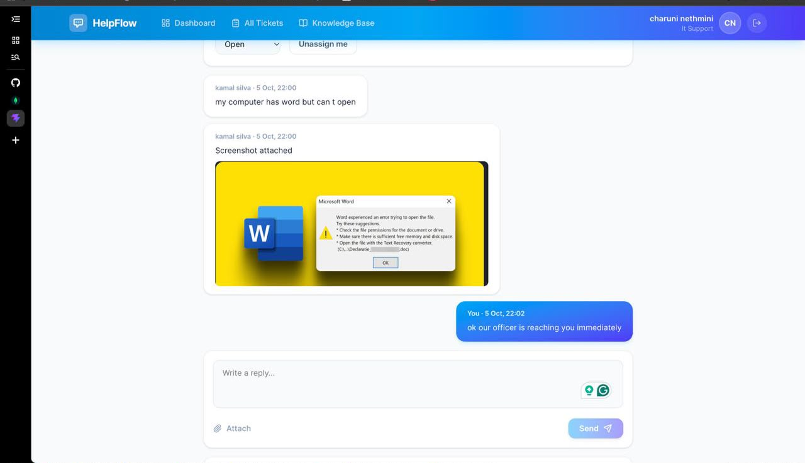

# 🚀 IT Helpdesk & Ticket Management System


A self-service, full-stack IT helpdesk application built with the **MERN** (MongoDB, Express, React, Node.js) stack. It streamlines the process of reporting, assigning, and resolving IT issues within an organization while providing a knowledge base for self-troubleshooting.

## ✨ Features

### 🏢 Employee (User) Features
- **Submit Tickets:** Easy-to-use form to report IT issues with priority and category tags.
- **My Requests:** Track the status of submitted tickets in real-time.
- **Interactive Comments:** Communicate with IT support on a ticket thread and attach files (images, PDFs, text).
- **Knowledge Base:** Browse published articles to self-solve common technical issues.

### 🛠️ IT Support Features
- **Ticket Queue:** Centralized dashboard to view, claim, and resolve open tickets.
- **Status Updates:** Update ticket statuses (`open`, `in_progress`, `resolved`, `closed`).
- **Knowledge Base Management:** Draft, publish, and manage help articles.

### 🛡️ Admin Features
- **Analytics Dashboard:** Visual overview of ticket volume, statuses, and recent activity.
- **User Management:** Manage employee roles (`employee`, `it_support`, `admin`) and deactivate accounts.
- **Global Ticket Assignment:** Assign specific tickets to any IT support staff member.

### 🔒 Security & Backend
- **Role-Based Access Control (RBAC):** Middleware-enforced authorization across the entire API and React Router.
- **Secure Authentication:** JWT-based login with bcrypt password hashing.
- **Zod Validation:** Strict input validation at the route layer.
- **Email Notifications:** Automated Nodemailer alerts for ticket creation, assignment, and status changes.
- **Secure Password Reset:** Expiring, SHA-256 hashed reset tokens.

---

## 📸 Screenshots

| Dashboard | Ticket View |
|:---:|:---:|
|  |  |

| Knowledge Base | User Management |
|:---:|:---:|
|  |  |

| Comments & Replies |
|:---:|
|  |

---

## 🛠️ Tech Stack

**Frontend:**
- React 19 (Vite)
- Tailwind CSS v4
- React Router v7
- Axios
- Lucide React (Icons)

**Backend:**
- Node.js & Express 5
- MongoDB & Mongoose
- Zod (Validation)
- JSON Web Tokens (JWT) & bcryptjs
- Multer (File Uploads)
- Nodemailer (Email integration)

---

## 🚀 Getting Started

### Prerequisites
- Node.js (v18+)
- MongoDB instance (local or MongoDB Atlas)

### 1. Clone the repository
```bash
git clone https://github.com/yourusername/helpdesk-system.git
cd helpdesk-system
```

### 2. Backend Setup
```bash
cd server
npm install
```

Create a `.env` file in the `server` directory based on `.env.example`:
```env
PORT=5001
MONGO_URI=mongodb://127.0.0.1:27017/helpdesk
JWT_SECRET=your_super_secret_key
CLIENT_URL=http://localhost:5173

# Email config (Optional, for notifications/password reset)
EMAIL_ENABLED=false
EMAIL_USER=your_email@gmail.com
EMAIL_PASS=your_app_password
EMAIL_FROM=IT Helpdesk <noreply@yourdomain.com>
```

Seed the database with an initial Admin account and sample articles:
```bash
npm run seed:admin
npm run seed:articles
```

Start the backend server:
```bash
npm run dev
```

### 3. Frontend Setup
Open a new terminal window:
```bash
cd client
npm install
```

Start the Vite development server:
```bash
npm run dev
```

---

## 🔑 Default Credentials

If you ran `npm run seed:admin`, you can log in with:
- **Email:** `admin@helpdesk.local`
- **Password:** `admin123`

*Please change this password immediately after your first login.*

---

## 📂 Project Structure

```text
helpdesk-system/
├── client/                 # React Frontend
│   ├── src/
│   │   ├── api/            # Axios instance configuration
│   │   ├── components/     # Reusable UI components
│   │   ├── context/        # React Context (Auth)
│   │   ├── pages/          # Application views/routes
│   │   └── lib/            # Utility functions & constants
├── server/                 # Node.js Backend
│   ├── config/             # DB connection
│   ├── controllers/        # Request handlers
│   ├── middleware/         # Auth, Upload, Validation
│   ├── models/             # Mongoose schemas
│   ├── routes/             # Express routes
│   ├── schemas/            # Zod validation schemas
│   └── utils/              # Email, Activity Logger helpers
└── README.md
```
